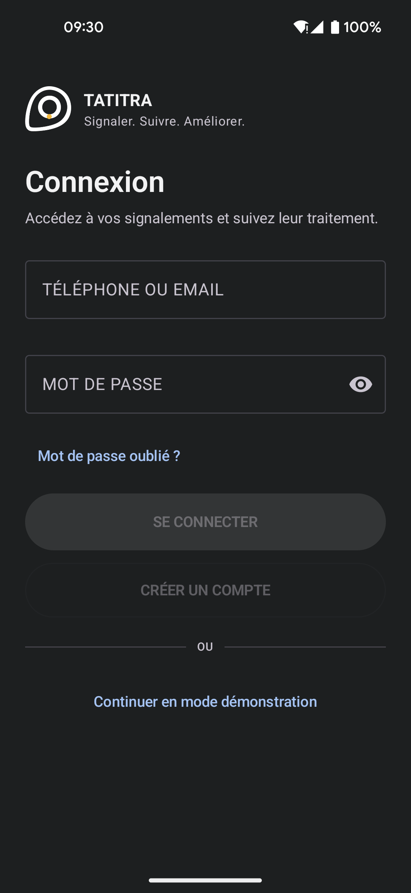
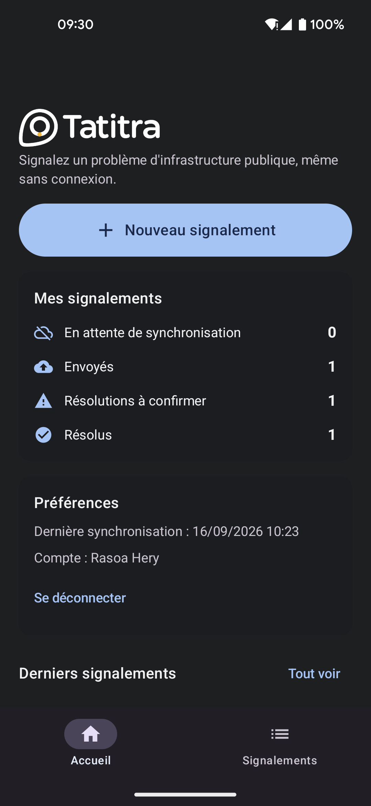
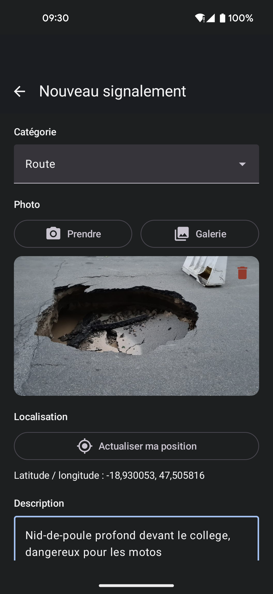
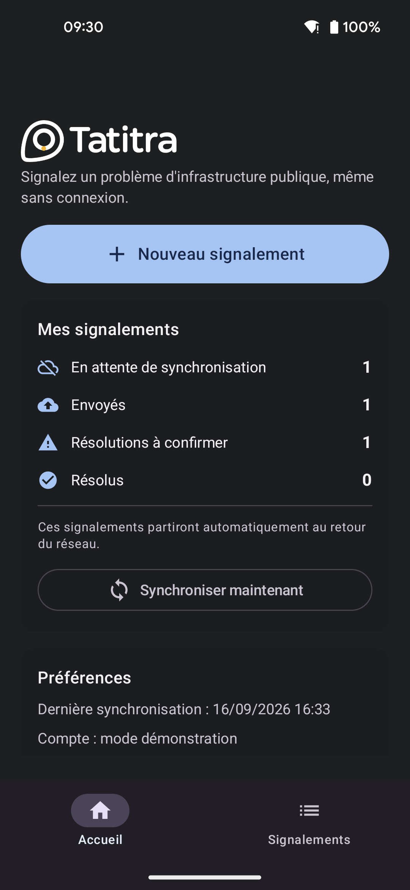
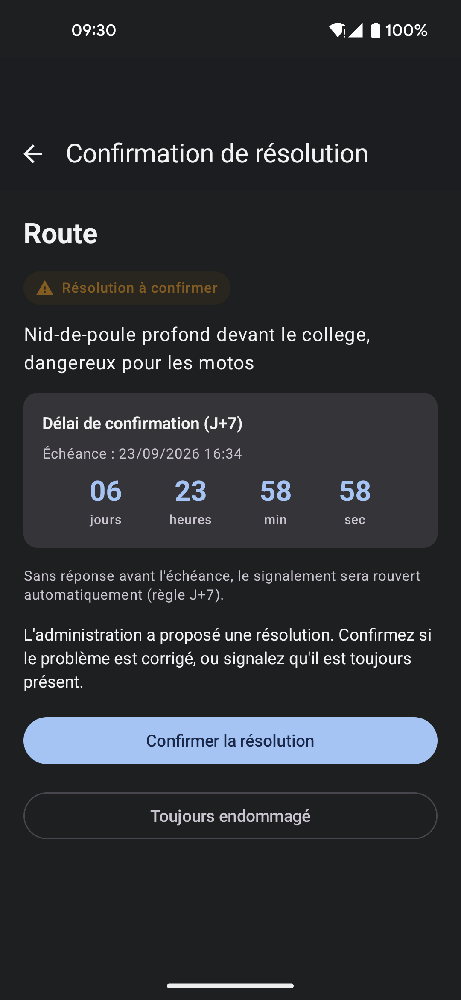
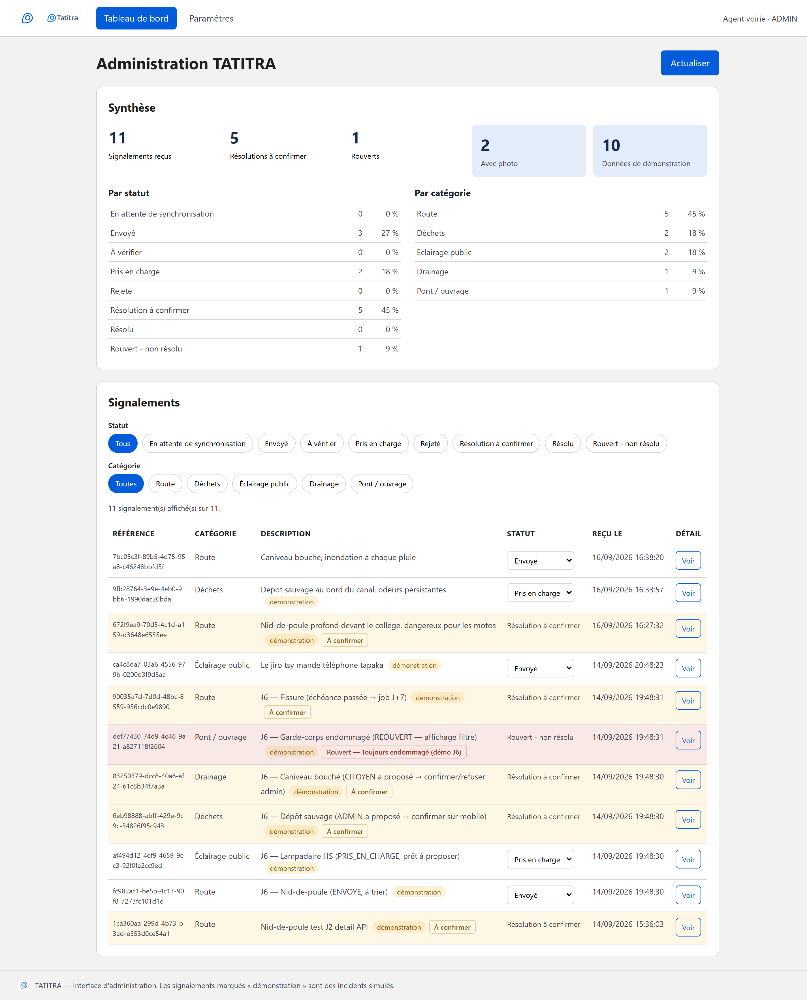

<div align="center">


# Tatitra

**Signaler. Suivre. Améliorer.**

Application citoyenne de signalement des problèmes d’infrastructures publiques à Madagascar.
Fonctionne sans connexion : le signalement part tout seul dès que le réseau revient.


</div>

---

## Aperçu

<table>
  <tr>
    <td align="center" width="50%">
      
    </td>
    <td align="center" width="50%">
      
    </td>
  </tr>
  <tr>
    <td align="center"><sub><b>Connexion</b> — Supabase Auth, ou accès direct en mode démonstration</sub></td>
    <td align="center"><sub><b>Accueil</b> — suivi des signalements, de l’envoi à la résolution confirmée</sub></td>
  </tr>
</table>

<table>
  <tr>
    <td align="center" width="33%">
      
    </td>
    <td align="center" width="33%">
      
    </td>
    <td align="center" width="33%">
      
    </td>
  </tr>
  <tr>
    <td align="center"><sub><b>Signaler</b> — photo, GPS et description</sub></td>
    <td align="center"><sub><b>Hors ligne</b> — envoi différé au retour du réseau</sub></td>
    <td align="center"><sub><b>Confirmer</b> — compte à rebours J+7 en direct</sub></td>
  </tr>
</table>

<div align="center">
  
  <br><sub><b>Interface d’administration</b> — synthèse, filtres et triage des signalements</sub>
</div>

---

## Fonctionnalités

- **Signalement complet** — catégorie, description, photo et position GPS.
- **Offline-first** — le signalement est écrit dans Room avant tout appel réseau, puis synchronisé par WorkManager dès qu’une connexion est disponible.
- **Synchronisation idempotente** — chaque signalement porte un `clientId` sous contrainte `UNIQUE` : un nouvel essai ne crée jamais de doublon.
- **Validation croisée de résolution** — citoyen et administration peuvent proposer qu’un problème est réglé, mais l’autre partie doit confirmer. Un dossier ne se ferme jamais unilatéralement.
- **Règle J+7** — sans confirmation sous sept jours, le dossier est rouvert automatiquement par une tâche planifiée côté serveur, indépendamment de l’état du téléphone.
- **Interface d’administration** — tableau de bord filtrable, triage par statut, actions de résolution.
- **Authentification** — Supabase Auth par e-mail, ou mode démonstration qui préserve l’usage hors ligne dès le premier lancement.

---

## Architecture

Trois parties indépendantes, reliées par une seule API REST. L’application mobile ne touche jamais
la base distante : elle lit et écrit dans sa base Room locale, qui reste utilisable sans réseau.

```
                  ┌───────────────────────┐
                  │  Android — citoyen    │   GPS · Caméra
                  │  Kotlin · Compose     │   Supabase Auth
                  │  Room · WorkManager   │
                  └───────────┬───────────┘
                              │ HTTPS
                              ▼
┌──────────────────┐   ┌───────────────────────┐   ┌──────────────────────┐
│  Admin Web       │──►│  API REST             │──►│  PostgreSQL          │
│  React · Vite    │   │  Node · Express       │   │  Supabase Storage    │
│  agent           │◄──│  Validation · job J+7 │◄──│                      │
└──────────────────┘   └───────────────────────┘   └──────────────────────┘
```

| Couche | Technologie |
|--------|-------------|
| Mobile — UI | Kotlin, Jetpack Compose, Material 3 |
| Mobile — Architecture | MVVM, ViewModel, StateFlow |
| Mobile — Stockage local | Room + Flow, DataStore pour les préférences |
| Mobile — Synchronisation | WorkManager, reprise différée avec backoff exponentiel |
| Mobile — Réseau | Retrofit, OkHttp, coroutines |
| Backend | Node.js 22, Express 5 |
| Base de données | PostgreSQL (Supabase) |
| Stockage des photos | Supabase Storage, repli local `backend/uploads` |
| Tâche planifiée | node-cron — réouverture automatique J+7 |
| Administration | React 19, Vite |

---

## Démarrage rapide

Prérequis : Node.js 22+, JDK 17+, Android Studio, et un projet Supabase.

```bash
# 1. Backend — port 3000
cd backend
cp .env.example .env          # renseigner DATABASE_URL et les clés Supabase
npm install
npm run db:init               # crée la table signalements
npm run dev

# 2. Interface d'administration — port 5173
cd admin-web && npm install && npm run dev

# 3. Application Android
adb reverse tcp:3000 tcp:3000
./gradlew :app:installDebug
```

Le guide complet — variables d’environnement, configuration Supabase, choix de l’adresse d’API,
dépannage — se trouve dans **[INSTALLATION.md](INSTALLATION.md)**.

---

## Tests

```bash
cd backend && npm test        # 65 tests
./gradlew :app:testDebugUnitTest   # 95 tests
```

**160 tests automatisés**, tous exécutables sans téléphone, sans serveur et sans compte Supabase :
base, API et stockage sont simulés.

| Portée | Couverture |
|--------|-----------|
| Règles de saisie | Longueur de description, bornes GPS, format d’e-mail et de mot de passe |
| Repository mobile | Fonctionnement en ligne, hors ligne, et face à un refus serveur |
| Authentification | Ouverture de session, confirmation d’e-mail requise, traduction des refus Supabase |
| Résolution | Proposer, confirmer, rouvrir, expiration J+7 |
| Idempotence | Un même `clientId` envoyé deux fois ne crée qu’une ligne |
| Contrat partagé | Statuts, catégories et rôles vérifiés identiques entre Kotlin, backend et admin |

Un test instrumenté (`NavigationListeDetailTest`) vérifie la conservation de l’état à la navigation.

---

## Arborescence

```
Tatitra-app/
├── app/                        # Application Android (citoyen)
│   └── src/
│       ├── main/java/mg/itu/tatitra_app/
│       │   ├── data/           # local (Room), remote (Retrofit), repository
│       │   ├── domain/         # Modèles et règles métier, sans dépendance Android
│       │   ├── ui/             # auth, home, report, reports, navigation, components
│       │   └── worker/         # Synchronisation différée (WorkManager)
│       ├── test/               # Tests unitaires JVM
│       └── androidTest/        # Test instrumenté de navigation
├── backend/                    # API REST
│   ├── src/                    # routes, controllers, services, db, middleware
│   └── tests/                  # Tests node --test
├── admin-web/                  # Interface d'administration
│   └── src/                    # pages, components, services
├── docs/
│   ├── Cahier_des_charges_TATITRA_v1.2.pdf
│   ├── branding/               # Logos et icônes
│   ├── captures/               # Captures d'écran
│   └── prototypes/             # Maquettes HTML
└── Photos/                     # Photos d'incidents de démonstration
```

---

## Documentation

| Document | Contenu |
|----------|---------|
| [INSTALLATION.md](INSTALLATION.md) | Installation pas à pas, configuration Supabase, endpoints, dépannage |
| [ANDROID_STUDIO.md](ANDROID_STUDIO.md) | Ouvrir le projet correctement dans Android Studio |
| [docs/captures/SOURCES.md](docs/captures/SOURCES.md) | Provenance des captures et licences des photos |

---

<div align="center">
<sub>Master 1 Développement Mobile — Institut de Technologie d’Universités (ITU), Madagascar · 2026</sub>
</div>
